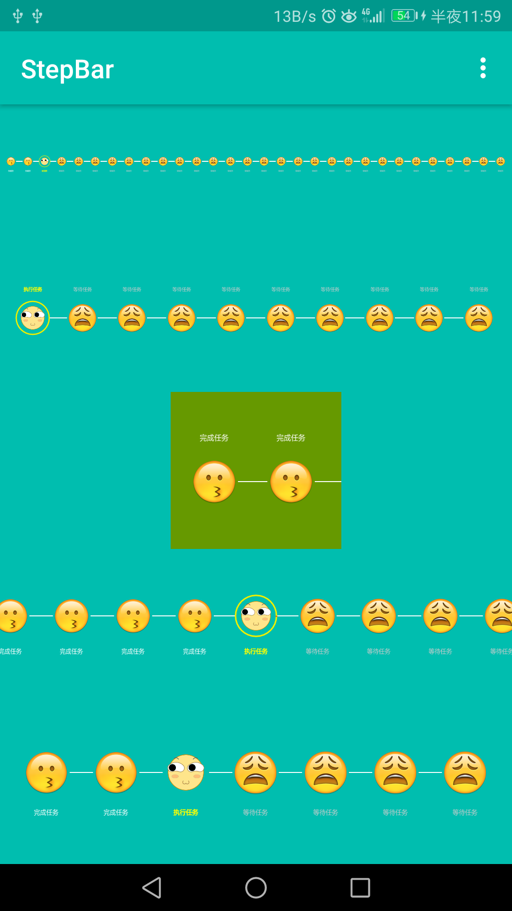
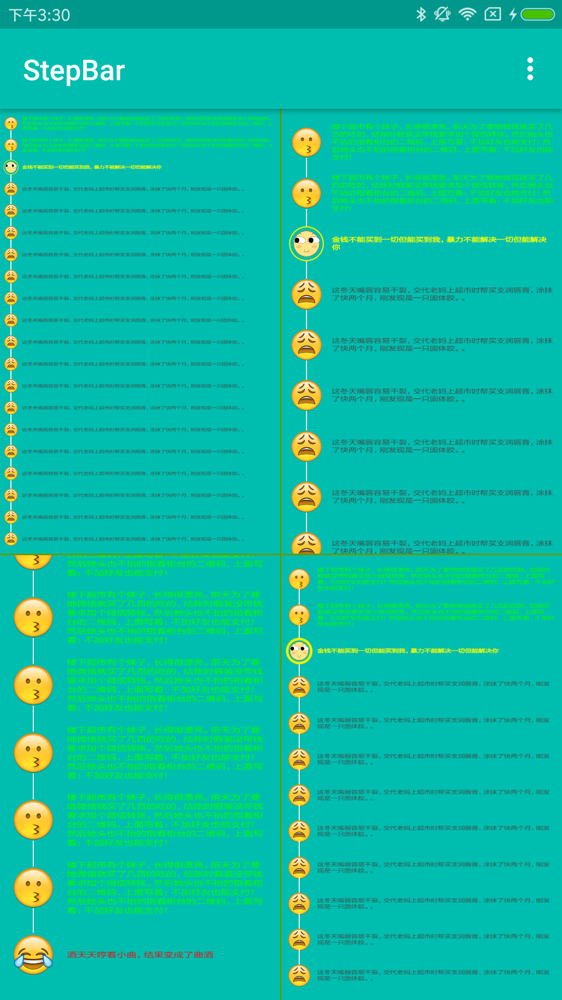
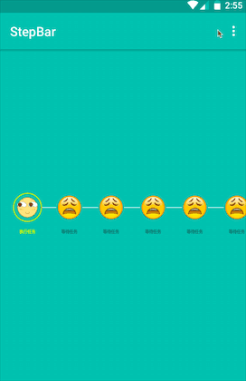
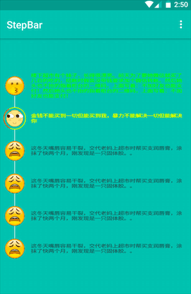

# StepBar [](https://github.com/HelloHuDi/StepBar/raw/master/app/release/app-release.apk) [](https://github.com/HelloHuDi/StepBar/raw/master/app/release/app-release.apk) 

## step-by-step that can control progress, support static and dynamic display

## horizontal and vertical static effect

  

## horizontal and vertical dynamic effect

  

## How to use

### add the dependency

```
dependencies {
    compile 'com.hd.stepbar:stepbar:1.3'
}
```
### in xml

```
 <com.hd.stepbar.StepBar
        android:layout_width="match_parent"
        android:layout_height="wrap_content"
        android:gravity="center"
        android:orientation="horizontal"/>
```

#### StepBar extends LinearLayout,so,can be adjust the display direction by setting orientation attribute.

##### set horizontal show or vertical show:
```
//int xml 
android:orientation="horizontal | vertical" 

//or use code
StepBar.setOrientation(LinearLayout.HORIZONTAL | LinearLayout.VERTICAL);
```

### code (main code)

```
StepBarConfig config = new StepBarConfig();
config.setBeanList(LinkedList<StepBarBean> beanList);
StepBar.addConfig(config);
```

#### StepBarBean:

```
StepBarBean bean = new StepBarBean.Builder(getActivity())
                  .setState(StepBarConfig.StepSate.COMPLETED)
                  .setRunningIcon(ContextCompat.getDrawable(getActivity(), R.drawable.running))
                  .setWaitingIcon(ContextCompat.getDrawable(getActivity(), R.drawable.waiting))
                  .setCompletedIcon(ContextCompat.getDrawable(getActivity(), R.drawable.complete))
                  .setFailedIcon(ContextCompat.getDrawable(getActivity(), R.drawable.fail))
                  .setOutsideIconRingForegroundColor(Color.RED)
                  .setOutsideIconRingBackgroundColor(Color.parseColor("#EEEE00"))
                  .setConnectLineColor(Color.WHITE)
                  .setRunningTextColor(Color.YELLOW)
                  .setCompletedTextColor(Color.GREEN)
                  .setWaitingTextColor(Color.DKGRAY)
                  .setFailedTextColor(Color.RED)
                  .setCompletedText("completed text")
                  .setRunningText("running text")
                  .setWaitingText("waiting text")
                  .setFailedText("failed text")
                  .build();
```

#### StepBarConfig:

```
StepBarConfig config = new StepBarConfig()
                      .setBeanList(LinkedList<StepBarBean> beanList)
                      //if the value is not set, the icon will be automatically resized in the allowable range
                      .setIconCircleRadius()
                      //if the value is not set, then will be adjust automatically
                      .setOutsideIconRingWidth()
                      //set the text size in pixel units
                      .setTextSize()
                      //set StepBar show state
                      .setShowState(StepBarConfig.StepShowState.DYNAMIC)
                      //add progress control call back
                      .addStepCallback(StepBarConfig.StepCallback);
```